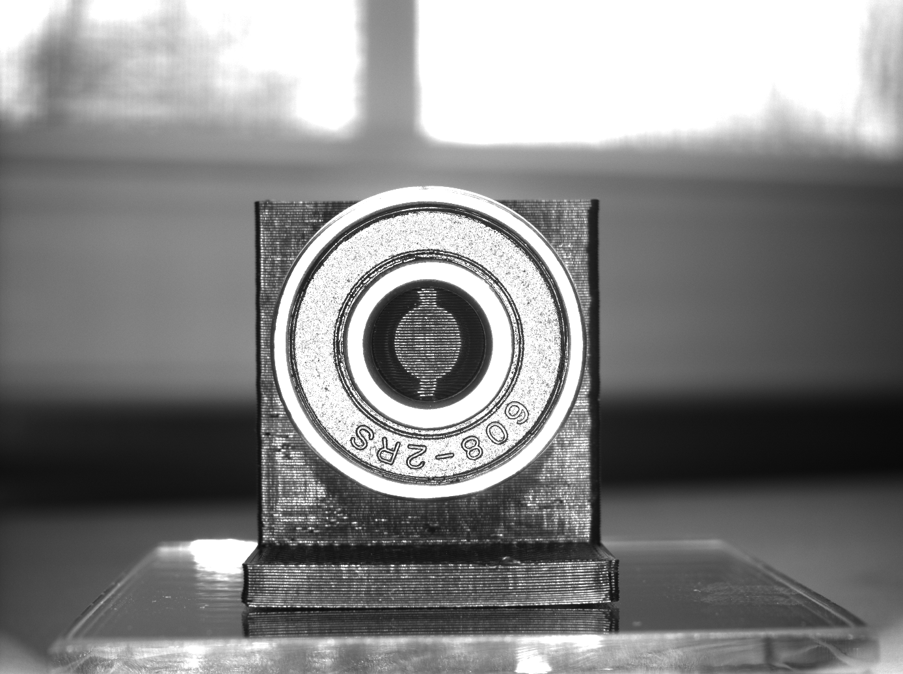
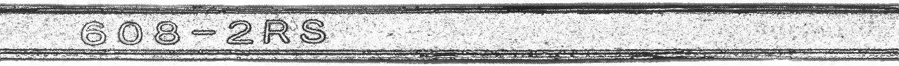
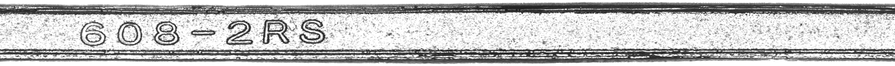
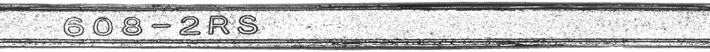

# Python Polar Unwrap

Linear polar unwrap implemented with **NumPy** for Machine/Computer vision. A linear polar unwrap is a 2D geometric transformation that remaps an image to a polar coordinate space. 

- OpenCV Reference: [warpPolar()](https://docs.opencv.org/3.4/da/d54/group__imgproc__transform.html#ga49481ab24fdaa0ffa4d3e63d14c0d5e4)
- OpenCV Reference: [InterpolationFlags](https://docs.opencv.org/4.x/da/d54/group__imgproc__transform.html#ga5bb5a1fea74ea38e1a5445ca803ff121)
- OpenCV Reference: [Remapping](https://docs.opencv.org/4.x/d1/da0/tutorial_remap.html)

This implementation of the polar unwrap allows for selecting a minimum or inner radius instead of starting at a center point. In this way, the transformation only selects the necessary pixel region (an annulus vs a circle) for the function, allowing for faster execution.

# Updates 12/13/2022
- Refactor Code w/ optimizations.
- Add google colab notebook.
- Add flags for specifying unwrap directions.
  - Change ccw flag to direction over vertical axis. (clock-wise vs. counter clock-wise).
  - Change flip flag to flip output image over horizontal axis.
- Remove np.meshgrid and replace with faster broadcasting method. (Performance Increase)
- Add remap function from opencv. Allows for the use of interpolation methods for improved quality. Without remap function the produced image quality was equivalent to cv2.INTER_NEAREST (IMAGE Quality Increase)
- Add .astype('float') to numpy array initialization vs. separate conversion step for remap. (Performance Increase)
- Replace math.pi with np.pi.
- Replace time.time() with perf_counter() to calculate execution time, more accurate.
- Add interpolated images to README for quality comparison.

# Example Image Transformation

Here is an example input image of a 806-2RS ball bearing. 

The example output image of the unwrapped 806-2RS ball bearing.

The example output image of the unwrapped 806-2RS ball bearing - **INTER_LINEAR**.

The example output image of the unwrapped 806-2RS ball bearing - **INTER_CUBIC**.

The example output image of the unwrapped 806-2RS ball bearing - **INTER_LANCZOS4**.

  