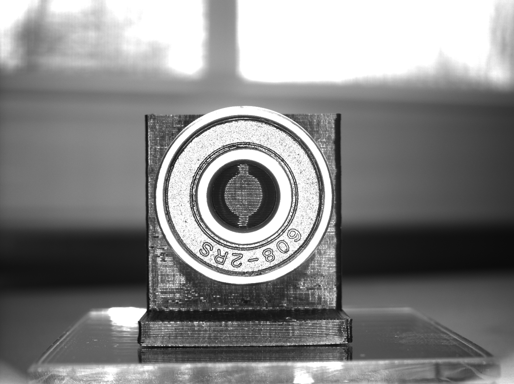
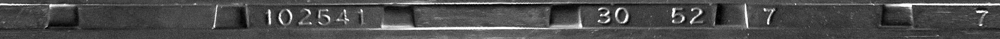

# Python Polar Unwrap

Linear polar unwrap implemented with **NumPy** for Machine/Computer vision. A linear polar unwrap is a 2D geometric transformation that remaps an image to a polar coordinate space. 

OpenCV Reference: [warpPolar()](https://docs.opencv.org/3.4/da/d54/group__imgproc__transform.html#ga49481ab24fdaa0ffa4d3e63d14c0d5e4)

This implementation of the polar unwrap allows for select a minimum or inner radius instead of starting at a center point. In this way, the transformation only selects the necessary pixel region (an annulus vs a circle) for the function, allowing for faster execution.

# Example Image Transformation

Here is an example input image of a 806-2RS ball bearing. 

The example output image of the unwraped 806-2RS ball bearing.

